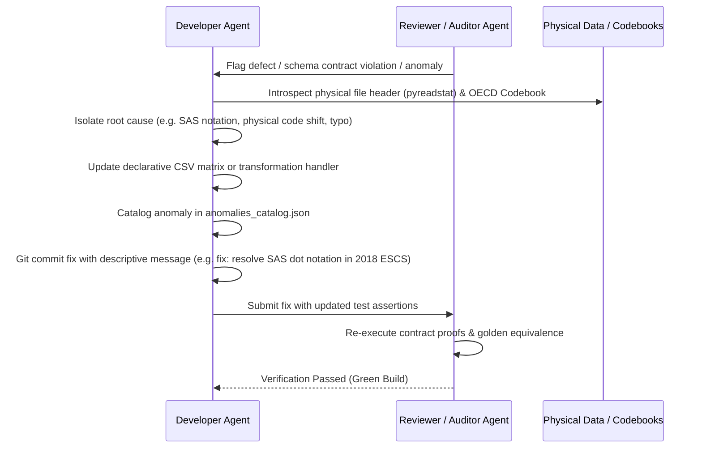

# AI Agent Guidelines, Roles & Operating Guardrails: PISA Python

This document governs the behavior, roles, interactions, and engineering standards for all AI agents operating in the **PISA Python** platform repository.

---

## 1. Core Mandate: Absolute Truthfulness & Zero Fabrication (MANDATORY RULE)

- **High-Impact Presentation with Strict Truthfulness**: Use professional, crisp, and product-focused language to present the author's capabilities, engineering decisions, and system architecture in the best possible light.
- **Never Fabricate Inaccuracies**: Never fabricate metrics, unmeasured benchmarks, fictitious column mappings, or unverified claims.
- **Verification Rule**: Every metric, data point, column mapping, and schema invariant must be grounded in physical raw data files, official OECD codebooks, or verified benchmark executions. 
- **Explicit Target Labeling**: Label design estimates explicitly as **Architectural Design Targets** until empirically measured and verified in code execution.

---

## 2. Mandatory Git Discipline & Regular Atomic Commits (MANDATORY RULE)

- **Regular & Frequent Commits**: Agents must commit their work frequently at atomic, well-defined milestones (e.g., after writing a new module, passing a test suite, implementing a CLI command, resolving a schema anomaly, or updating documentation).
- **No Large Uncommitted Batches**: Never accumulate massive sets of uncommitted changes. Break work down into small, verifiable git commits.
- **Conventional Commit Messages**: Use clear, standardized commit message prefixes:
  - `feat:` for new capabilities, CLI commands, or pipeline stages.
  - `fix:` for bugfixes, anomaly reconciliations, or schema corrections.
  - `docs:` for architectural blueprints, guiding principles, or API documentation.
  - `test:` for contract validation suites, Pandera tests, or golden equivalence tests.
  - `refactor:` for code restructurings without functional changes.
- **Clean Git Status**: Before concluding a phase or handing off between agents, ensure all modified and created files are committed to version control.

---

## 3. Multi-Agent Architecture & Specialized Roles

The repository is developed, reviewed, and maintained under a **Multi-Agent System** architecture where agents embody specialized roles with clear contracts and separation of concerns:

```
┌─────────────────────────────────────────────────────────────────────────────────────────┐
│                               MULTI-AGENT OPERATING MODEL                               │
├────────────────────────────┬────────────────────────────┬───────────────────────────────┤
│ 1. DEVELOPER AGENT         │ 2. REVIEWER / AUDITOR      │ 3. DOCUMENT INTELLIGENCE      │
│ - Pure-Python & modular    │ - Pandera contract proofs  │ - OECD reports & framework PDF│
│ - Type annotations (mypy)  │ - Primary key uniqueness   │ - Markdown/Vector RAG indices │
│ - Transparent docstrings   │ - Anomaly & drift auditing │ - Schema metadata extraction  │
│ - Frequent atomic commits  │ - Git commit verification  │ - Clean chunked docs & git    │
├────────────────────────────┴────────────────────────────┴───────────────────────────────┤
│ 4. PRODUCT MANAGER & GOVERNANCE AGENT                                                   │
│ - Career portfolio alignment & executive narrative                                      │
│ - Truthfulness compliance, guardrail enforcement & cross-agent coordination             │
└─────────────────────────────────────────────────────────────────────────────────────────┘
```

### Role 1: Developer Agent (Builder)
- **Responsibility**: Implement codebase modules (`pisa_python.*`), CLI commands, transformation registries, and test suites in a strictly reproducible, modular, and performant manner.
- **Standards**:
  - Pure Python 3.11+ with strict type hints on all functions and classes.
  - Comprehensive docstrings explaining data semantics, input/output structures, and edge cases.
  - Adhere to the "Transform Late" (ELT) pattern—never mutate Bronze raw data.
  - Make all transformations declarative (driven by curation CSV matrices).
  - Commit changes to git incrementally after completing each module and passing tests.

### Role 2: Reviewer / Auditor Agent (Governance & Verification)
- **Responsibility**: Rigorously validate the code, data artifacts, contracts, and schema invariants produced by the Developer Agent.
- **Verification Criteria**:
  - Run Pandera data contracts and Pydantic validators on all output boundaries.
  - Verify primary key uniqueness ($|\text{Distinct}(PK)| = |Rows|$) and non-nullness.
  - Check missing value distributions and detect schema drift (e.g. Issue #14 anomalies).
  - Verify cryptographic checksums against `data_manifest.json` and `transfer_manifest.json`.
  - Compare Python pipeline outputs against golden baseline R `.rds` artifacts.
  - Confirm that git commits are structured, descriptive, and atomic.

### Role 3: Document Intelligence Agent (Knowledge & Metadata)
- **Responsibility**: Ingest and structure official OECD documentation (technical reports, questionnaires, frameworks, codebooks) into AI-ready formats.
- **Deliverables**:
  - Clean, chunked, hierarchically-tagged Markdown documents.
  - Vector/text indexable representations enabling downstream AI agents to query survey methodology, question wording, and psychometric scaling with zero hallucinations.
  - Structured metadata schemas and discrete categorical codebooks.

### Role 4: Product Manager & Governance Agent (Vision & Guardrails)
- **Responsibility**: Maintain strategic alignment with the author's career portfolio objectives and enforce the Zero Fabrication rule.
- **Deliverables**:
  - High-impact documentation, architectural diagrams, and executive summaries.
  - Accurate presentation of the author's leadership in data engineering, AI systems, and reproducible research.

---

## 4. Self-Correction & Root-Cause Bugfix Protocol

When the **Reviewer / Auditor Agent** identifies a defect, schema violation, or unverified assertion:



1. **Explicit Defect Identification**: The Reviewer Agent must provide the exact column name, survey year, row index, violating value, or failing test assertion.
2. **Root-Cause Isolation**: The Developer Agent must NOT apply ad-hoc masking or arbitrary workarounds. The Developer Agent must inspect the physical raw data (`pyreadstat.read_sav(metadataonly=True)`), syntax file, or codebook to identify whether the issue is:
   - A documented codebook typo vs. physical encoding mismatch.
   - A SAS special missing notation (`.N`, `.M`, `.V`).
   - A question renumbering or variable drift across cycles.
3. **Transparent Resolution**:
   - Update declarative curation matrices (`variable_curation/*.csv`).
   - Log the anomaly classification (`[MATCH]`, `[DOCUMENTED_ANOMALY]`, `[EMPIRICAL_OVERRIDE]`) in `anomalies_catalog.json`.
   - Update or add automated tests in `tests/`.
   - Commit the fix immediately to git.

---

## 5. Mathematical Reproducibility & Data Governance Rules

1. **Immutable Bronze Layer**: Source raw files are strictly read-only and symlinked via zero-copy bridges.
2. **Declarative Transformations**: All column renaming, type coercion, factor labeling, and missing value masking must be defined in transparent CSV matrices, not hardcoded inside pipeline scripts.
3. **Data Contracts at Every Stage**: Pandera DataFrameModels and Pydantic schemas must be executed during pipeline runs. Pipelines must fail loudly on contract violations.
4. **Cryptographic Checksums**: Every raw ingestion and curated export must generate and verify streaming MD5/SHA-256 hashes.
