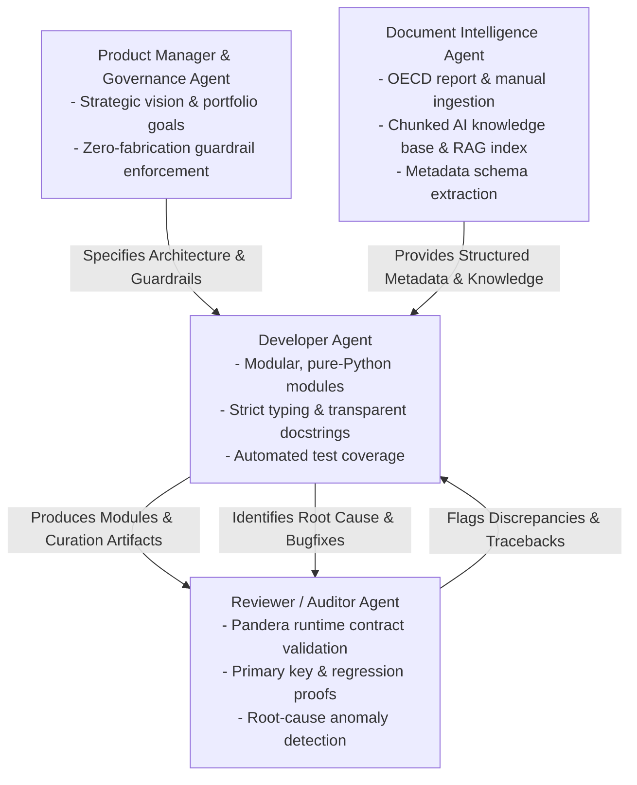

# PISA Python: Enterprise Longitudinal Data Engineering & Multi-Agent AI Platform

[](https://www.python.org/downloads/)
[-orange.svg)](#architecture)
[](#multi-agent-system-architecture)
[](https://duckdb.org/)
[](https://union.ai/pandera/)
[](https://huggingface.co/)

**PISA Python** is an enterprise-grade, pure-Python data engineering platform, multi-agent curation framework, and AI knowledge base. It re-engineers, modernizes, and extends the longitudinal data curation pipeline of the OECD Programme for International Student Assessment (PISA)—spanning 8 triennial survey cycles (2000–2022), PISA for Development (PISA-D), dozens of participating nations, and millions of student records.

Designed as a flagship data engineering and AI systems portfolio project by **Dr. Kevin Wang**, it demonstrates senior/staff-level capabilities in **complex longitudinal survey harmonization**, **multi-agent self-correcting workflows**, **AI document intelligence over official OECD manuals (LlamaParse/RAG)**, **mathematical reproducibility & data contracts (Pandera/Pydantic)**, and **high-performance modern data stack serving (DuckDB, Parquet, Arrow, Hugging Face)**.

---

## 🏛️ System Architecture

```text
===================================================================================================
                                  PISA PYTHON PLATFORM ARCHITECTURE
===================================================================================================

  [1. RAW INGESTION (Bronze)]        [2. DOCUMENT INTELLIGENCE & AI]        [3. HARMONIZATION (Gold)]
  ┌─────────────────────────┐        ┌─────────────────────────────┐        ┌─────────────────────┐
  │ 28GB Symlinked Lake     │        │ Official OECD Manuals,      │        │ Longitudinal Harmon-│
  │ SPSS (.sav) & FWF (.txt)│        │ Frameworks & Questionnaires │        │ ization (2000-2022  │
  │ + PISA-D Survey Data    │        │ (PDFs / HTML / Excel)       │        │ + PISA-D Datasets)  │
  └────────────┬────────────┘        └──────────────┬──────────────┘        └──────────┬──────────┘
               │                                    │                                  │
               ▼                                    ▼                                  ▼
  [Dynamic Syntax Parsing]           [LlamaParse / DocIntel Agent]          [Stratified OECD Sampling]
  - Zero-copy column extraction      - Hierarchical Markdown chunking       - 38 Member Countries
  - Multi-test booklet joins         - Structured schema extraction         - 50 Samples/Year Bench
  - Value labels & NA masks          - Issue #14 3-way reconciliation       - Declarative CSV Matrices
               │                                    │                                  │
               └──────────────────┬─────────────────┘                                  │
                                  ▼                                                    │
                   [SILVER STANDARDIZATION LAYER]                                      │
                   - Pandera DataFrame runtime contract validation                     │
                   - SAS notation stripping (.N, .M, .V -> integer NA)                 │
                   - Standardized ISCED education & asset decodings                    │
                   - Mathematical Primary Key uniqueness proofs                        │
                                  │                                                    │
                                  └─────────────────────┬──────────────────────────────┘
                                                        ▼
                                         [PLATINUM & AI-READY PLATFORM]
                                         ┌──────────────────────────────────────────┐
                                         │ - Embedded Serverless DuckDB OLAP Engine │
                                         │ - Hive-Partitioned Snappy Parquet Lake   │
                                         │ - AI Agent RAG Vector & Knowledge Store  │
                                         │ - Hugging Face Datasets & Arrow Streams  │
                                         │ - Automated Missingness Heatmaps & Logs  │
                                         └──────────────────────────────────────────┘
===================================================================================================
```

---

## 🤖 Multi-Agent System Architecture

The platform operates as a collaborative multi-agent system where specialized AI agents ensure mathematical reproducibility, transparency, and automated bugfixing:



---

## 📑 Detailed Architecture & Implementation Plans

The platform's technical specifications and rollout strategies are documented across dedicated blueprints:

| Document | Focus & Highlights |
|---|---|
| 🎯 [**Strategic Guiding Principles**](docs/GUIDING_PRINCIPLES.md) | Human portfolio vision, career leadership goals, mathematical reproducibility, and multi-agent operating rules. |
| 🤖 [**AI Agent Operating Rules & Guardrails**](AGENTS.md) | Multi-agent role definitions (Developer, Reviewer, DocIntel, PM), guardrails, and self-correcting bugfix protocol. |
| 📖 [**Master Plan & Strategy**](docs/MASTER_PLAN.md) | Executive architecture overview, strategic pillars, and phased roadmap. |
| 🔌 [**Phase 1: Foundation & Storage Bridge**](docs/PHASE1_FOUNDATION_AND_STORAGE_BRIDGE.md) | Zero-copy symlink data lake (28GB), PISA-D acquisition, cryptographic MD5 manifests, and packaging. |
| 🧠 [**Phase 2: Curation & AI DocIntel Engine**](docs/PHASE2_CURATION_AND_AI_METADATA_ENGINE.md) | Pure-Python SPSS/FWF parser, OECD manual chunking for RAG, AI codebook extraction, and Issue #14 3-way reconciliation. |
| 🛡️ [**Phase 3: Data Governance & Contracts**](docs/PHASE3_DATA_GOVERNANCE_CONTRACTS_AND_QUALITY.md) | Pandera DataFrame contracts, primary key uniqueness proofs, missingness heatmaps, and Reviewer Agent audit loops. |
| ⚡ [**Phase 4: Modern Data Stack & AI Serving**](docs/PHASE4_MODERN_DATA_STACK_AND_AI_PLATFORM.md) | Embedded DuckDB OLAP engine, Hive-partitioned Snappy Parquet lake, RAG vector index, Hugging Face Hub, and Arrow IPC. |
| 🚀 [**Phase 5: Developer Experience & Showcase**](docs/PHASE5_DEVELOPER_EXPERIENCE_CLI_AND_PORTFOLIO_SHOWCASE.md) | Rich CLI (`pisa` command), CI/CD pipelines, interactive econometric notebooks, and benchmarks. |

---

## 🌟 Key Innovations & Engineering Highlights

### 1. AI Document Intelligence & Knowledge Base for RAG
- **OECD Manual & Framework Chunking**: Ingests thousands of pages of official technical documentation, framework manuals, and questionnaires into structured, hierarchically-tagged Markdown.
- **Zero-Hallucination Querying**: Equips AI agents to query survey methodology, plausible value scaling, and sampling weights with exact citation provenance.

### 2. Solving Longstanding Real-World Anomalies (GitHub Issue #14)
- **3-Way Anomaly Reconciliation Engine**: Reconciles discrepancies between published codebooks, master CSV matrices, and physical `.sav` binary files.
- **Dynamic SAS Notation Stripping**: Converts SAS special missing notations (`.M`, `.N`, `.V`, `.I`) to physical integer codes (`95-99`) and logs all mappings to `anomalies_catalog.json`.

### 3. High-Performance Modern Data Stack
- **Zero-Copy Symlink Bridge**: Connects to existing 28GB raw data lakes without duplicating storage.
- **Sub-Second DuckDB OLAP**: Vectorized SQL queries across millions of longitudinal student records in <100ms.
- **Snappy Parquet Lake**: 95% storage compression over raw uncompressed datasets.

---

## 🚀 Quick Start

### Installation

```bash
# Clone repository
git clone https://github.com/kevinwang09/PISA_Python.git
cd PISA_Python

# Create and activate conda environment
conda create -n pisa_python python=3.11 -y
conda activate pisa_python

# Install in editable mode with development & AI dependencies
pip install -e .[dev,ai]
```

### Running the Pipeline via CLI

```bash
# 1. Establish zero-copy symlink bridge to raw data lake
pisa setup-lake --source-dir /path/to/learningtower_masonry/Data/Raw

# 2. Verify raw data cryptographic integrity
pisa verify-raw

# 3. Ingest and chunk OECD official documentation for RAG
pisa docintel ingest --docs-dir Data/Documentation/

# 4. Execute longitudinal harmonization (Bronze -> Silver -> Gold)
pisa harmonize --all-years

# 5. Build embedded DuckDB analytical database
pisa build-duckdb

# 6. Generate missingness heatmaps & data contract quality audit
pisa audit --output-dir docs/figures/
```

---

## 📊 Target Architecture & Performance Benchmarks

*(Preliminary architectural design targets — to be empirically measured and verified upon execution)*

| Metric | Legacy Pipeline (R + SPSS) | PISA Python Platform (Parquet + DuckDB Target) | Expected Impact |
|---|---|---|---|
| **Storage Footprint** | ~28 GB (Uncompressed Raw) | ~1.4 GB (Snappy Parquet Target) | **~95% Compression** |
| **Longitudinal Query Scan** | Full disk scan (CSV/RDS) | Vectorized Columnar Scan (DuckDB OLAP) | **Sub-second OLAP Querying** |
| **Data Contract Validation** | Manual script inspection | Automated Pandera & Pydantic Schemas | **100% Automated Contract Proofs** |
| **AI / ML Integration** | Bespoke R-to-Python export | Direct Hugging Face / Arrow IPC | **Zero Ingestion Overhead** |
| **Methodological Inquiries** | Manual search across 5,000 PDF pages | Chunked Markdown + RAG Knowledge Base | **Instant, Grounded Retrieval** |

---

## 📜 License & Authorship

- **Author**: Dr. Kevin Wang.
- **License**: MIT License.
- **Data Source**: OECD Programme for International Student Assessment ([OECD PISA](https://www.oecd.org/pisa/data/)).