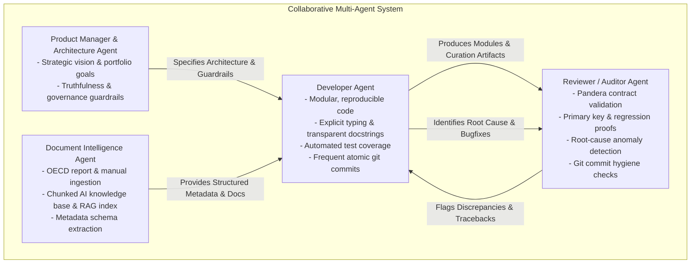

# PISA Python: Strategic Guiding Principles & Operating Philosophy

---

## 1. Executive Vision & Core Goals

**PISA Python** is engineered at the intersection of enterprise data engineering, automated data curation, and multi-agent AI systems. It re-architects and modernizes the OECD Programme for International Student Assessment (PISA) data curation pipeline (spanning 2000–2022, PISA for Development, and extensive official documentation) into an authoritative, AI-ready data platform.

The project is governed by two complementary goals:

```
┌─────────────────────────────────────────────────────────────────────────────────────────┐
│                                   CORE PROJECT GOALS                                    │
├────────────────────────────────────────────┬────────────────────────────────────────────┤
│           1. PRIMARY TECHNICAL GOAL        │           2. CAREER PORTFOLIO GOAL         │
│  Deliver an enterprise-grade, longitudinal │  Establish the author (Dr. Kevin Wang)     │
│  data asset and AI knowledge base that     │  as an industry leader in Data Engineering,│
│  surpasses raw OECD releases in quality,   │  AI Systems Architecture, and Data Product │
│  harmonization, and analytical usability.  │  Leadership through demonstrable rigor.    │
└────────────────────────────────────────────┴────────────────────────────────────────────┘
```

### Goal 1: High-Quality Data Curation Beyond OECD
Raw OECD PISA releases are notoriously complex, fragmented across 8 triennial cycles, shifting file formats (SPSS `.sav`, ASCII fixed-width, SAS exports), inconsistent missing value encodings (`.M`, `.N`, `.V`, `95-99`), and evolving survey questionnaires. 
- **Beyond OECD Standards**: This platform goes beyond raw published data by providing declarative harmonization, standardized ISCED educational classifications, primary key non-nullness and uniqueness guarantees, automated missingness profiling, and reconciled schema anomalies (e.g. Issue #14).
- **Document Intelligence for AI Agents**: Official technical reports, framework manuals, and survey codebooks are transformed into structured, chunked, AI-ready knowledge formats (Markdown/Vector embeddings) enabling AI agents and researchers to query methodology with high fidelity.

### Goal 2: Career Portfolio & Industry Leadership Showcase
This repository is a showcase of staff/principal-level engineering craftsmanship:
- **Exemplary System Design**: Production-grade Medallion architecture (Bronze, Silver, Gold, Platinum), declarative schema contracts (Pandera/Pydantic), and modern OLAP serving (DuckDB, Hive-partitioned Snappy Parquet, Arrow IPC, Hugging Face Hub).
- **AI Agentic Orchestration**: Implementation of a deterministic, multi-agent development and validation lifecycle with automated verification, transparent lineage, and self-correcting review loops.
- **Product-Driven Transparency**: Every data transformation is auditable, declarative, and accompanied by transparent curation matrices and machine-readable anomaly logs.

---

## 2. Fundamental Operating Principles

### Principle 1: Absolute Truthfulness & Zero Fabrication (Non-Negotiable)
- **Grounded in Physical Evidence**: Every metric, schema mapping, column coordinate, missing value code, and benchmark number must be directly verifiable against physical raw files, official OECD codebooks, or empirical code execution logs.
- **Explicit Labeling**: Theoretical or architectural targets must always be clearly labeled as **"Architectural Design Targets"** until empirically measured and recorded.
- **High-Impact, Objective Presentation**: Professional, crisp, product-focused language that highlights innovation while strictly maintaining mathematical honesty.

### Principle 2: Mathematical Reproducibility & Pure ELT ("Transform Late")
- **Immutable Bronze Storage**: Raw `.sav`, `.txt`, and PDF files remain untouched and immutable in Bronze storage, bridged via zero-copy symlinks.
- **Declarative Transformation Matrices**: Schema transformations, factor recodings, and variable standardizations are driven exclusively by auditable, version-controlled CSV matrices (`variable_curation/`).
- **Cryptographic Lineage**: Ingestion and transfer artifacts must carry streaming MD5/SHA-256 checksum manifests guaranteeing bit-for-bit reproducibility across machines and CI/CD pipelines.

### Principle 3: Multi-Agent System Paradigm
Development, auditing, and maintenance of this platform are conducted via specialized, collaborative AI agents with strict separation of concerns:



- **Developer Agent**: Writes modular, pure-Python code adhering to strict type hints (`mypy`), linting (`ruff`), and comprehensive documentation. Implements features in small, independently testable units, committing regularly to git.
- **Reviewer / Auditor Agent**: Systematically inspects outputs against Pandera schemas, primary key uniqueness invariants, missingness thresholds, and golden baseline comparisons with legacy R outputs.
- **Document Intelligence Agent**: Converts unstructured OECD documentation, survey framework PDFs, and questionnaires into structured Markdown, JSON-LD schemas, and vector embeddings.
- **Self-Correction & Root-Cause Analysis Loop**: When a Reviewer Agent flags an anomaly, the Developer Agent must inspect raw binary headers (`pyreadstat`), codebook JSONs, or transformation CSVs, isolate the exact origin of the divergence, apply a deterministic fix with updated test assertions, and commit the fix to git.

### Principle 4: Full Transparency in Data Curation
- No "black-box" heuristics or implicit data mutations.
- Every variable harmonization (e.g. `isced3a1`, `fe1ma2`, `book_levels_6`) is documented with its mathematical rationale, source question wording, and cycle-over-cycle drift notes.
- Anomalies (such as SAS special missing notations `.N`, `.M`, `.V` or code shifts in 2012 `ST26Q13` and 2022 `ESCS`) are cataloged in machine-readable `anomalies_catalog.json` with explicit classification (`[MATCH]`, `[DOCUMENTED_ANOMALY]`, `[EMPIRICAL_OVERRIDE]`).

---

## 3. Standards of Code & Engineering Excellence

| Dimension | Standard & Requirement |
|---|---|
| **Python Version & Typing** | Pure Python 3.11+, strict static typing with `mypy --strict`, explicit type hints on all function signatures. |
| **Package Architecture** | Standardized `pyproject.toml` (PEP 517/518/621), modular namespaces (`pisa_python.acquisition`, `.ingestion`, `.codebook`, `.transformation`, `.quality`, `.storage`, `.cli`). |
| **Testing & Verification** | `pytest` test suite with high test coverage, deterministic fixtures, and golden baseline regression tests. |
| **Data Contract Enforcement** | Runtime schema enforcement with **Pandera DataFrameModels** and **Pydantic v2** models on every data boundary. |
| **Git Discipline & Hygiene** | Regular atomic commits with Conventional Commit messages (`feat:`, `fix:`, `docs:`, `test:`, `refactor:`). Clean git tree at each milestone. |
| **Performance & Serving** | Embedded **DuckDB** OLAP engine, Hive-partitioned **Snappy Parquet** tables, **PyArrow IPC** streams, and **Hugging Face Datasets** hub integration. |
| **CLI & User Experience** | Unified, colorful, intuitive CLI powered by **Typer** and **Rich** (`pisa setup-lake`, `pisa harmonize`, `pisa audit`, etc.). |

---

## 4. Evaluation Checklist for Every Feature & Commit

Before any module, pipeline stage, or documentation update is approved:

- [ ] **Truthfulness Verified**: Are all claims, metrics, and mappings grounded in actual physical files or codebooks?
- [ ] **Reproducibility Guaranteed**: Can another engineer or CI runner execute the module from scratch and obtain identical bytes and checksums?
- [ ] **Data Contract Enforced**: Does the output pass strict Pandera schema validation with zero duplicate primary keys?
- [ ] **Transparency Maintained**: Is the curation step fully described in declarative CSV matrices and codebook catalogs?
- [ ] **Multi-Agent Review Passed**: Has the Reviewer Agent verified the changes, and has the Developer Agent addressed any edge cases or anomalies?
- [ ] **Git Commit Executed**: Is the work committed atomically with a descriptive, standard commit message?
- [ ] **Portfolio Impact Aligned**: Does this showcase exemplary data engineering, robust architecture, and clear leadership quality?
