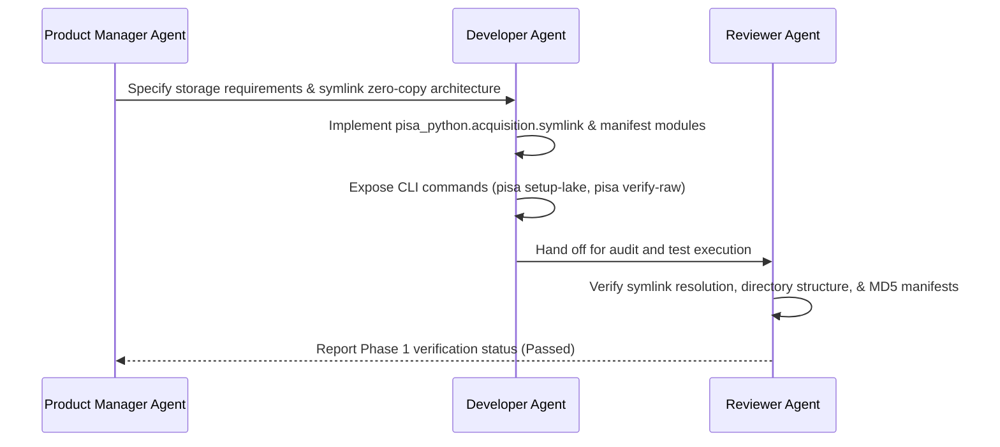

# Phase 1: Foundation, Storage Bridge & Raw Acquisition

---

## 1. Objective

Establish the foundational infrastructure and storage bridge for the PISA Python platform. This phase focuses on:
1. **Zero-Copy Data Lake Symlink Bridge**: Connecting the existing ~28GB raw PISA data lake (2000–2022 cycles, PISA for Development, and official documentation files) from `learningtower_masonry` to `PISA_Python` without duplicating disk storage.
2. **Automated Acquisition Engine**: Providing an idempotent downloader to fetch future PISA survey releases, technical manuals, and supplementary questionnaire files.
3. **Cryptographic Data Manifest**: Guaranteeing byte-for-byte reproducibility using streaming MD5 and SHA-256 verification.
4. **Modern Python Package Architecture**: Standardizing project packaging (`pyproject.toml`), dependency groups (`[dev,ai]`), and CLI foundations.
5. **Multi-Agent Governance**: Integrating the Developer Agent implementation lifecycle with automated Reviewer Agent checksum and path assertions.

---

## 2. Storage Architecture & Symlink Strategy

The raw dataset files across the 8 core PISA survey cycles (2000–2022) and PISA for Development (PISA-D) occupy ~28 GB on disk.

```text
/Users/kevinwang/projects/learningtower_masonry/Data/Raw/
  ├── 2000/ ... 2022/ (Raw .sav, .txt, .zip, and PDF codebooks)
  ├── PISA_for_Development_Data/ (PISA-D Cognitive, Questionnaire, Timing .SAV/.zip)
  ├── PISA Data Files.html (Official OECD portal snapshot)
  └── data_manifest.json
         │
         │  [ZERO-COPY SYMLINK BRIDGE / STORAGE ROUTER]
         ▼
/Users/kevinwang/projects/PISA_Python/
  ├── Data/
  │   ├── Raw/ -> symlinked to learningtower_masonry/Data/Raw/ (Immutable Bronze Lake)
  │   ├── Raw_New/ (Writable destination for new downloads, PISA-D expansions, future cycles)
  │   ├── Documentation/ (Structured OECD manuals, frameworks, and questionnaires)
  │   └── Output/ (Bronze, Silver, Gold, Platinum artifacts)
```

### Storage Bridge Specification
- **`pisa_python.acquisition.symlink`**: A robust utility module to inspect, verify, and establish directory symlinks to the source data lake.
- **Dynamic Path Resolver**: Checks `Data/Raw_New/` first (for overrides/updates), falling back to `Data/Raw/` (canonical symlinked lake).
- **Environment Overrides**: Supports `PISA_RAW_DATA_DIR=/custom/path` via `.env` or environment variables for CI/CD runners and cloud environments.

---

## 3. Automated Acquisition Pipeline (`pisa_python.acquisition`)

### Key Components

1. **`downloader.py`**:
   - Parses official OECD download portals and HTML mirrors (`PISA Data Files.html`).
   - Supports parallel chunked downloads with resume capabilities using `httpx` / `requests` and `tqdm` progress displays.
   - CLI commands: `pisa download --year 2022` or `pisa download --pisa-d`.

2. **`manifest.py`**:
   - Generates and verifies `data_manifest.json`.
   - Computes streaming MD5 and SHA-256 checksums to verify local files against remote signatures.
   - Raises explicit `DataIntegrityError` if local files are corrupted or altered.

3. **`extractor.py`**:
   - Unzips multi-part archives into year-specific directories.
   - Handles legacy encoding quirks (e.g. Windows-1252 zip headers).
   - Generates `extracted_files_tree.json` summarizing file sizes, formats, and hierarchical structure.

---

## 4. Multi-Agent System Workflow for Phase 1



---

## 5. Modern Python Package Configuration

The project uses `pyproject.toml` adhering to PEP 517/518 and PEP 621 standards:

```toml
[build-system]
requires = ["setuptools>=61.0"]
build-backend = "setuptools.build_meta"

[project]
name = "pisa-python"
version = "1.0.0"
description = "Enterprise-Grade PISA Data Engineering & AI-Ready Harmonization Platform"
readme = "README.md"
requires-python = ">=3.11"
authors = [{ name = "Kevin Wang" }]
dependencies = [
    "pandas>=2.1.0",
    "pyreadstat>=1.2.6",
    "pyarrow>=15.0.0",
    "duckdb>=1.0.0",
    "pandera>=0.18.0",
    "pydantic>=2.6.0",
    "typer>=0.9.0",
    "rich>=13.7.0",
    "pyyaml>=6.0.1",
    "requests>=2.31.0",
    "beautifulsoup4>=4.12.0",
    "tqdm>=4.66.0",
    "matplotlib>=3.8.0",
    "seaborn>=0.13.0",
]

[project.optional-dependencies]
ai = [
    "llama-cloud>=0.1.0",
    "llama-parse>=0.4.0",
    "datasets>=2.18.0",
]
dev = [
    "pytest>=8.0.0",
    "pytest-cov>=4.1.0",
    "ruff>=0.3.0",
    "mypy>=1.8.0",
]

[project.scripts]
pisa = "pisa_python.cli:app"
```

---

## 6. Deliverables & Verification Checklist for Phase 1

1. ✅ Symlink manager module and automated CLI command (`pisa setup-lake`).
2. ✅ Automated download and manifest verification module (`pisa verify-raw`).
3. ✅ Working `pyproject.toml` and environment configuration in `learningtower` conda environment.
4. ✅ Automated unit tests in `tests/test_acquisition.py`.
5. ✅ Reviewer Agent verification of zero-copy disk resolution and MD5 manifests.
