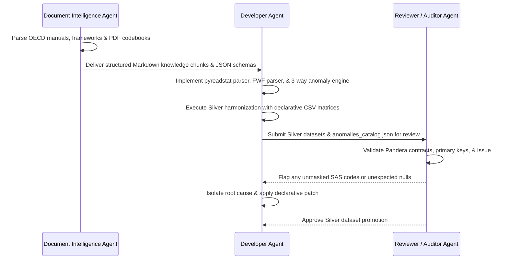

# Phase 2: Curation, Ingestion & AI Document Intelligence Engine

---

## 1. Objective

Replace the legacy R-based data curation and Haven/Tidyverse scripts with a high-performance, pure-Python ingestion, document intelligence, and transformation engine. This phase addresses:
1. **Pure-Python SPSS & ASCII Ingestion**: Fast extraction of `.sav` files via `pyreadstat` and dynamic syntax-driven fixed-width ASCII parsing across 2000–2022 and PISA for Development (PISA-D).
2. **AI Document Intelligence for OECD Documentation**: Ingesting, parsing, and chunking official OECD Technical Reports, Framework Manuals, and Questionnaires into AI-ready Markdown knowledge bases for RAG-driven AI agent analysis.
3. **AI-Powered Codebook Extraction**: Automated extraction of legacy PDF and modern Excel data dictionaries into standardized JSON schemas using LlamaParse and constrained Pydantic validators.
4. **Comprehensive Resolution for GitHub Issue #14 & Schema Drift**: 3-Way automated reconciliation between published codebook metadata, master CSV curation matrices, and physical `.sav` binary encodings.
5. **Transform Late (ELT) Execution**: Preservation of immutable Bronze intermediate extracts, applying centralized transformations and factor decodings in Silver.

---

## 2. Platform Subsystems & Architecture

```text
===================================================================================================
                       PHASE 2 INGESTION & DOCUMENT INTELLIGENCE SUBSYSTEMS
===================================================================================================

  [1. TABULAR INGESTION (Bronze)]             [2. DOCUMENT INTELLIGENCE & KNOWLEDGE (AI)]
  ┌─────────────────────────────────┐        ┌────────────────────────────────────────┐
  │ SPSS (.sav) & FWF (.txt)        │        │ Official OECD Technical Reports,       │
  │ - 2000-2022 Survey Cycles       │        │ Frameworks & Questionnaires (PDF/HTML) │
  │ - PISA for Development (PISA-D) │        │ + PDF/Excel Codebooks (2000-2022)      │
  └────────────────┬────────────────┘        └───────────────────┬────────────────────┘
                   │                                             │
                   ▼                                             ▼
  [Dynamic Syntax & Header Parsing]               [DocIntel Agent & LlamaParse Engine]
  - pyreadstat zero-copy column slices            - Hierarchical section & table chunking
  - Absolute position FWF reading                 - Pydantic-constrained JSON schema extract
  - Value labels & NA mask extraction             - Vector/RAG-ready Markdown knowledge base
                   │                                             │
                   └──────────────────────┬──────────────────────┘
                                          ▼
                        [3-Way Anomaly Reconciliation Engine]
                        - Match physical .sav header vs Codebook vs Curated CSV
                        - Strip SAS special missing notation (.M, .N, .V -> 95-99)
                        - Auto-classify: [MATCH], [DOCUMENTED_ANOMALY], [EMPIRICAL_OVERRIDE]
                        - Generate auditable codebook/anomalies/anomalies_catalog.json
                                          │
                                          ▼
                        [SILVER STANDARDIZATION & HARMONIZATION]
                        - Declarative transformations via variable_curation/*.csv
                        - Standardized ISCED levels, demographics, and assets
                        - Primary key enforcement (country, school_id, student_id)
===================================================================================================
```

---

## 3. AI Document Intelligence & Knowledge Base (`pisa_python.docintel`)

OECD PISA publishes thousands of pages of official documentation detailing survey sampling, cognitive item response theory (IRT) plausible value estimation, index construction (e.g. ESCS, WEALTH), and questionnaire rotation designs. 

To enable AI agents and researchers to query this methodology rapidly with zero hallucinations:

### 1. Ingestion of Official Documentation
- **Assessment Frameworks**: Ingests conceptual frameworks explaining cognitive domain definitions (Mathematics, Reading, Science, Creative Thinking).
- **Technical Reports**: Parses chapters on sampling weights (`W_FSTUWT`), plausible values, and non-response bias adjustments.
- **Questionnaires**: Extracts exact question wording and response scales for student, school, and parent instruments.

### 2. Hierarchical Markdown Chunking & Semantic Tagging
- Uses **LlamaParse** and specialized heuristic extractors to preserve complex tables, mathematical equations, and hierarchical section headers.
- Tags every chunk with semantic metadata: `{"year": YYYY, "document_type": "technical_report|framework|questionnaire", "domain": "math|reading|science|escs", "section": "..."}`.
- Outputs structured Markdown artifacts to `Data/Documentation/chunked/` for immediate RAG indexing and AI agent querying.

---

## 4. AI-Powered Codebook Extraction (`pisa_python.codebook`)

To eliminate manual data dictionary transcription:

1. **Legacy PDF Codebooks (2000–2012)**:
   - **Step 1 (Parse)**: Uses **LlamaParse** / LlamaCloud to parse heavy PDF tables into structured Markdown.
   - **Step 2 (Anchor Windowing)**: Scans Markdown for "Seed Anchors" (uppercase variable tokens) and constructs overlapping context windows (`window_size=30`, `step_size=27`).
   - **Step 3 (Structured Extract)**: Dispatches windows concurrently to LlamaCloud Extract constrained by `extracted_pdf_schema.json`.
   - **Step 4 (Deduplicate & Validate)**: Deduplicates extracted variables and validates against Pydantic schema models.

2. **Modern Excel Codebooks (2015–2022)**:
   - Automated multi-sheet Pandas extractor (`extract_tabular_codebook.py`) reading variable definitions, discrete key-value pairs, and missing value indicators.

---

## 5. Comprehensive Solution for GitHub Issue #14 & Schema Drift

### The Problem in Issue #14
In `learningtower_masonry/issues/14` and across multiple PISA survey years:
- **Codebook vs Physical Data Discrepancies**: Published codebooks frequently list missing codes that differ from physical `.sav` binary files.
  - *Example 1*: In 2012 student data, variable `ST26Q13` (dishwasher) had codebook keys `{1, 2, 7, 8}`, but the schema expected `9` (System Missing), causing validation failures.
  - *Example 2*: In 2018 and 2022, `ESCS` and `WEALTH` codebooks documented missing codes as `9999995`, `9999997`, whereas the physical `.sav` data used `95`, `97`, `98`, `99`.
  - *Example 3*: SAS dot notations (`.N/97` vs `97/.N`) mixed SAS special missing codes (`.V`, `.N`, `.I`, `.M`) with physical integer codes.

### The Automated Solution (`pisa_python.transformation.anomaly_engine`)

We implement a **3-Way Automated Reconciliation Engine**:

```
 ┌───────────────────────────┐    ┌───────────────────────────┐    ┌───────────────────────────┐
 │ 1. Extracted Codebook JSON│    │ 2. Curated Matrix CSV     │    │ 3. Physical .SAV Metadata │
 │ (Published Documentation) │    │ (Target Schema Design)    │    │ (Binary pyreadstat Header)│
 └─────────────┬─────────────┘    └─────────────┬─────────────┘    └─────────────┬─────────────┘
               │                                │                                │
               └───────────────────────┬────────┴────────────────────────────────┘
                                       ▼
                     [3-Way Anomaly Reconciliation Engine]
                     1. Extract physical distinct NA codes from .SAV header
                     2. Compare with Codebook JSON definitions
                     3. Validate against Curated CSV schema
                     4. Auto-classify & resolve:
                        - [MATCH]: Code verified in all 3 sources
                        - [DOCUMENTED_ANOMALY]: Codebook typo, data verified
                        - [EMPIRICAL_OVERRIDE]: Valid physical code auto-masked
                        - [CRITICAL_ERROR]: Missing target or untyped column
```

1. **Binary Header Introspection**: Using `pyreadstat.read_sav(metadataonly=True)`, we extract exact missing value codes, variable value labels, and storage formats directly from the raw binary files.
2. **Dynamic SAS Notation Stripper**: Automatically parses slash-separated codes (`.N/97`), strips non-numeric SAS syntax (`.V`, `.N`, `.I`, `.M`), and isolates physical data values.
3. **Automated Anomaly Audit Log**: Any mismatch between codebook JSON and physical data generates an auditable, structured anomaly entry in `codebook/anomalies/anomalies_catalog.json` rather than failing blindly or silently passing.

---

## 6. Declarative Transformation Engine (`pisa_python.transformation`)

All transformations are driven declaratively by the master CSV schema files (`variable_curation/PISA_variable_curation_*.csv`):

### Standardized Transformation Registry
- **`isced3a1` / `iscednone1`**: Harmonizes parental education into standardized ISCED tiers (`less than ISCED1`, `ISCED 1`, `ISCED 2`, `ISCED 3B, C`, `ISCED 3A`).
- **`fe1ma2`**: Decodes gender (`1 = female`, `2 = male`).
- **`yes1no2`**: Binary possession indicators (`1 = yes`, `2 = no`).
- **`none1one2two3threemore4`**: Quantified possession counters (`0`, `1`, `2`, `3+`).
- **`book_levels_6` / `book_levels_7`**: Categorical home book ranges (`0-10`, `11-25`, `26-100`, `101-200`, `201-500`, `More than 500`).
- **`public_private`**: School governance classification.

### Specialized Survey Handlers
- **2000 PISA Multi-Booklet Join**: Joins Reading, Math, and Science sub-assessments on primary keys `(country, school_id, student_id)` using primary test inclusion weights (`w_fstuwt`) without row inflation.
- **2022 PISA Computer Synthesis**: Synthesizes desktop (`ST254Q02JA`) and laptop (`ST254Q03JA`) into longitudinal `computer` and `computer_n` metrics.
- **PISA for Development (PISA-D) Ingestion**: Maps PISA-D student and school questionnaires into the longitudinal schema with survey indicator flags.

---

## 7. Multi-Agent Workflow for Phase 2



---

## 8. Deliverables & Verification for Phase 2

1. ✅ `pisa_python.ingestion` (pure Python SPSS, FWF, and PISA-D parsers).
2. ✅ `pisa_python.docintel` (OECD manual, framework, and questionnaire chunking engine).
3. ✅ `pisa_python.codebook` (AI PDF/Excel extractors with Pydantic contracts).
4. ✅ `pisa_python.transformation` (3-Way Anomaly Engine & Transformation Registry).
5. ✅ Auditable `codebook/anomalies/anomalies_catalog.json`.
6. ✅ Automated test suites in `tests/test_spss_parser.py`, `tests/test_transformations.py`, `tests/test_docintel.py`, and `tests/test_anomaly_engine.py`.
