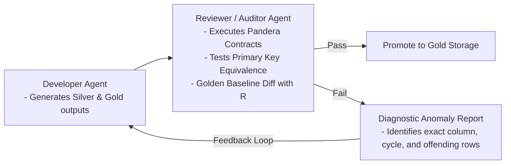

# Phase 3: Data Governance, Contracts & Multi-Agent Quality Assurance

---

## 1. Objective

Implement an enterprise-grade data governance, runtime contract enforcement, and multi-agent quality assurance framework. This phase guarantees:
1. **Mathematical Reproducibility**: Mathematical proof that every ingested, transformed, and harmonized row satisfies strict integrity invariants.
2. **Declarative Runtime Data Contracts**: Schema validation via **Pandera DataFrameModels** and **Pydantic v2**.
3. **Primary Key Constraints**: Non-nullness and strict uniqueness enforcement on all primary key tuples across every survey cycle and PISA-D.
4. **Visual Quality & Missingness Audits**: Automated generation of missingness heatmaps, lineage manifests, and Markdown quality reports.
5. **Cross-Language Golden Baseline Verification**: Exact regression audits comparing Python pipeline outputs against legacy R `.rds` artifacts.
6. **Multi-Agent Reviewer / Auditor Integration**: An automated audit loop where the Reviewer Agent validates data contracts and pinpoints defects for the Developer Agent to resolve.

---

## 2. Declarative Data Contracts (`pisa_python.quality.contracts`)

We define strict Pandera schemas for all three core entities:

```python
import pandera as pa
from pandera.typing import Series

class StudentSchema(pa.DataFrameModel):
    year: Series[int] = pa.Field(isin=[2000, 2003, 2006, 2009, 2012, 2015, 2018, 2022])
    country: Series[str] = pa.Field(str_length={"min_value": 3, "max_value": 3}, nullable=False)
    school_id: Series[str] = pa.Field(nullable=False)
    student_id: Series[str] = pa.Field(nullable=False)
    
    # Plausible score values (0 - 1000 standard PISA scale)
    math: Series[float] = pa.Field(ge=0.0, le=1000.0, nullable=True)
    read: Series[float] = pa.Field(ge=0.0, le=1000.0, nullable=True)
    science: Series[float] = pa.Field(ge=0.0, le=1000.0, nullable=True)
    stu_wgt: Series[float] = pa.Field(ge=0.0, nullable=True)
    
    # Demographic & Socio-economic factors
    gender: Series[str] = pa.Field(isin=["female", "male"], nullable=True)
    mother_educ: Series[str] = pa.Field(
        isin=["less than ISCED1", "ISCED 1", "ISCED 2", "ISCED 3B, C", "ISCED 3A"], 
        nullable=True
    )
    father_educ: Series[str] = pa.Field(
        isin=["less than ISCED1", "ISCED 1", "ISCED 2", "ISCED 3B, C", "ISCED 3A"], 
        nullable=True
    )
    computer: Series[str] = pa.Field(isin=["yes", "no"], nullable=True)
    internet: Series[str] = pa.Field(isin=["yes", "no"], nullable=True)
    desk: Series[str] = pa.Field(isin=["yes", "no"], nullable=True)
    room: Series[str] = pa.Field(isin=["yes", "no"], nullable=True)
    dishwasher: Series[str] = pa.Field(isin=["yes", "no"], nullable=True)
    television: Series[str] = pa.Field(isin=["0", "1", "2", "3+"], nullable=True)
    computer_n: Series[str] = pa.Field(isin=["0", "1", "2", "3+"], nullable=True)
    car: Series[str] = pa.Field(isin=["0", "1", "2", "3+"], nullable=True)
    book: Series[str] = pa.Field(
        isin=["0", "1-10", "11-25", "26-100", "101-200", "201-500", "More than 500"], 
        nullable=True
    )
    wealth: Series[float] = pa.Field(nullable=True)
    escs: Series[float] = pa.Field(nullable=True)

    class Config:
        strict = True  # Reject unapproved columns
        coerce = True
```

---

## 3. Primary Key Uniqueness & Integrity Proofs

In the PISA data model, IDs are strictly hierarchical:
- **Student Data PK**: `(country, school_id, student_id)`
- **School Data PK**: `(country, school_id)`

### Mathematical Proof Enforcer (`pisa_python.quality.auditor`)
Before any dataset is promoted from Silver to Gold:
1. **Zero Nulls Assertion**:
   $$\forall \text{ row } r, \quad r[\text{country}] \neq \text{null} \land r[\text{school\_id}] \neq \text{null} \land r[\text{student\_id}] \neq \text{null}$$
2. **Cardinality Equivalence**:
   $$|\text{Distinct}(df, [\text{country}, \text{school\_id}, \text{student\_id}])| = |df|$$
   If any duplicate primary key is discovered, the pipeline immediately halts, logs the exact colliding rows, and outputs a diagnostic trace.

---

## 4. Visual Quality Audits & Missingness Heatmaps

To provide executive visibility over longitudinal data completeness, the pipeline automatically compiles:
- `README_student_data_missing_values_summary.png`: Visual percentage missingness heatmap across all 19 standardized variables and 8 survey cycles.
- `README_school_data_missing_values_summary.png`: Missingness across school indices.
- **Automated Markdown / HTML Audit Logs**: Generates comprehensive lineage and data quality summaries saved to `docs/figures/` and `docs/audits/`.

```
┌─────────────────────────────────────────────────────────────────────────────┐
│                    MISSINGNESS AUDIT ENGINE WORKFLOW                        │
│                                                                             │
│  [Gold Harmonized Dataset] ──► [pisa_python.quality.reporting]              │
│                                          │                                  │
│                   ┌──────────────────────┴─────────────────────┐            │
│                   ▼                                            ▼            │
│  [Matplotlib / Seaborn Heatmap]                 [Markdown / HTML Audit Logs]│
│  - Per-variable % missing by year               - Row counts & schema checks│
│  - Color-gradient visualization                 - Value distributions       │
│  - Saved to docs/figures/                       - Lineage checksum table    │
└─────────────────────────────────────────────────────────────────────────────┘
```

---

## 5. Multi-Agent Reviewer / Auditor Workflow



---

## 6. Golden Baseline Cross-Validation

To mathematically prove equivalence with the original peer-reviewed R package:
- `tests/test_golden_equivalence.py`: Loads legacy `.rds` files from `learningtower_masonry/Data/Output/Transfer/` and compares them against Python Parquet outputs for matching dimensions, value distributions, factor labels, and null counts.

---

## 7. Deliverables & Verification for Phase 3

1. ✅ `pisa_python.quality.contracts` (Pandera and Pydantic schema definitions).
2. ✅ `pisa_python.quality.auditor` (Primary key & dataframe diff enforcer).
3. ✅ `pisa_python.quality.reporting` (Automated heatmap & markdown report generator).
4. ✅ Reviewer Agent automated contract validation loop.
5. ✅ Automated tests in `tests/test_contracts.py` and `tests/test_golden_equivalence.py`.
